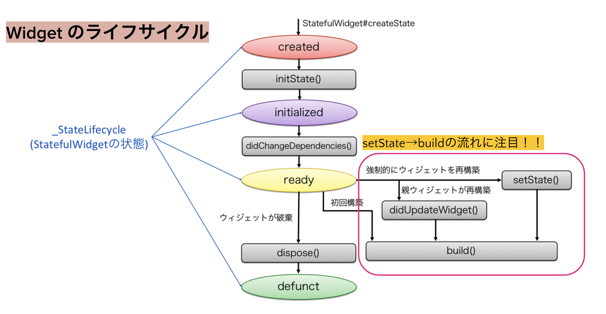

# Flutter の設計思想と、State とは何かについて

Flutter SDK が提供している UI 構築の考え方及び状態管理の手法について、解説しています。

## 宣言的 UI

Flutter では、**宣言的 UI** という考えに基づき UI を構築します。簡単に言うと、全ての UI はコンストラクタで初期化され、初期化された UI オブジェクトは後から変更できない、というものです。

以下のようなコードは一切書けないようになっています。UI を生成して、後から属性を変更することができません。

```dart
var textButton = TextButton(child: Text("aaa"));
textButton.onPress(() => print("tapped")); // onPressはfinalなので変更不可
```

Flutter の UI 部品は全て Dart で記述できます。iOS の UIKit が提供している Interface Builder や Storyboard、Android の レイアウト記述用 XML ファイル などは一切不要です。全てが Dart(コード)で記述できることで、UI コンポーネントの表現力が飛躍的に高まり、再利用性が高くなっています。

例えば`TextField`ですと、フォントの指定・色やサイズ・プレースホルダー等の表示の話から、Change イベントや Submit イベントなどのイベントハンドラ、バリデーションロジックなどが全部コンストラクタで書けるようになっています。

## Everything is Widget

Flutter では、UI を担う全てのパーツを `Widget`（ウィジェット) と呼んでいます。

Text や ListView のようなものだけではなく、アニメーション、レイアウト、余白、画像なども全て Widget になります。Flutter は公式で多くのウイジェットが用意されており、これらを組み合わせて UI を作ります。UIKit から Flutter に来ると、Widget の多さにとても嬉しい思いをすると思います。

UI は、Widget をネストすることで表現されます。画面の中央にテキストを表示するコードはこうなります。

```dart
Center(
  child: Text(
    'Hello, world!',
    textDirection: TextDirection.ltr,
  )
);
```

`Center` は画面の中央にウィジェットを表示する役割を担います。 `child` パラメーターで、Center ウィジェットの中に表示したいウィジェットを指定します。ここでは、固定文字列を出力する `Text` ウィジェットを指定して、 `textDirection` に左から右に表示するようにしています。Flutter のウイジェットは、コンストラクタの引数に指定するパラメーターに応じて UI の表示や構成を記述します。

### build 関数

Android における`onCreateView`、iOS における`ViewDidLoad`のようなものです。オーバーライドして実装する必要があります。必須です。この関数の中に Widget のコードを記載します。

```dart
class SampleWidget extends StatelessWidget {

  @override
  Widget build(BuildContext context) {
    return Center(
      child: Text(
        'Hello, world!',
        textDirection: TextDirection.ltr,
      )
    );
  }
}
```

## どうやって UI を更新するのか

先程、Flutter では **初期化された UI オブジェクトは後から変更できない** と記述しました。では、ユーザーの操作によってテキストの中身を変えたい場合、どうしたら良いのかという疑問が出てくると思います。なにしろ、`sampleTextField.text = "update!"` と書くことができないので。

ここで登場するのが、`State`の存在です。Flutter においては、Widget が自分を管理する State を別に持っていて、そちらを参照しています。UI を更新する時は、**「State が更新されたので、もう 1 度自分を再構築(build)してください」** と State に対して指示を出します。それを受け取った State は、自分が管理している Widget の build 関数を呼び出します。

その流れを説明した図は、以下の通りです。



右下を見てください。`setState`から`build`に線が出ています。これが先程申し上げた、State に更新を伝える方法です。`setState`が呼び出されると、自動的にその Widget の`build`が呼び出されます。

## StatefulWidget と StatelessWidget

Widget のライフサイクルを管理し、操作できる Widget のことを `StatefulWidget` と言います。一方で、ライフサイクルを一切管理しない Widget のことを `StatelessWidget` と言います。違いはそれだけですが、コードの書き方が結構違います。`StatefulWidget`を使う場合、コードの記述量がとても多くなります。

### StatefulWidget を使ってみる

Flutter で `flutter create` というコマンドを実行すると生成されるサンプルプロジェクトのコードを抜粋したものです。上述した State のライフサイクルを追いかけることを意識して下さい。

```dart
class MyHomePage extends StatefulWidget {
  const MyHomePage({Key? key, required this.title}) : super(key: key);
  final String title;

  @override
  State<MyHomePage> createState() => _MyHomePageState();
}

class _MyHomePageState extends State<MyHomePage> {
  int _counter = 0;

  @override
  Widget build(BuildContext context) {
    return Scaffold(
      appBar: AppBar(
        title: Text(widget.title),
      ),
      body: Center(
        child: Column(
          mainAxisAlignment: MainAxisAlignment.center,
          children: <Widget>[
            const Text(
              'You have pushed the button this many times:',
            ),
            Text(
              '$_counter',
              style: Theme.of(context).textTheme.headline4,
            ),
          ],
        ),
      ),
      floatingActionButton: FloatingActionButton(
        onPressed:() => setState(() { _counter++;}),
        tooltip: 'Increment',
        child: const Icon(Icons.add),
      ),
    );
  }
}

```

### createState

該当箇所だけを抜粋します。

```dart
class MyHomePage extends StatefulWidget {
  const MyHomePage({Key? key, required this.title}) : super(key: key);
  final String title;

  @override
  State<MyHomePage> createState() => _MyHomePageState();
}
```

`StatefulWidget` は Widget をビルドする `build` 関数を持っていません。その代わりに必ずオーバーライドするのが、この `createState` 関数です。

`createState` 関数は `State<StatefuiWidget>` が戻り値です。実際には自分以外の State を作る意味はありませんので、 `State<MyHomePage> createState()` となります。

Flutter の Widget からは、直接 State を触ることはないので、画面遷移や初期化の際にパラメータが必要であれば、Widget クラス側に寄せます。これらのパラメーターは、State クラスの`widget`フィールドを経由して取得できます。`widget.title` という格好です。

`build`関数は、State クラスに委譲されています。UI の更新は、State クラスが行います。 `build` 関数を実装するだけです。

### setState

```dart
 floatingActionButton: FloatingActionButton(
      onPressed:() => setState( () => _counter++;),
      tooltip: 'Increment',
      child: const Icon(Icons.add),
  ),
```

本件で最も重要な関数 `setState` です。setState は戻り値を持ちません。引数には、戻り値を持たない関数(VoidCallback)を入れます。

`_counter++` という処理が setState で実行されています。これにより、 `_counter` がインクリメントされた状態で `build` 関数がもう 1 度呼び出され Widget が再構築されます。

もし、以下のようなコードを書いたとすると、一向に画面の表示は変わりません。State のメンバを更新するだけではダメで、State に更新されたことを伝えないといけないからです。この例では 1 つの変数だけですが、4 つのフィールドを持つオブジェクトを同時に更新した時などを考えていただけると、`setState` を呼び出す意味が伝わるかと思います。

```dart
 onPressed:() => _counter++,
```

## 大変申し訳無いのですが

ここまで`setState`を中心に`StatefulWidget`の使い方を書きましたが、実務上ほとんど使うことがありません。

State と Widget が 1 対 1 で紐づくので、Widget 単体の状態を管理するのは向いているのですが、Widget をまたいだ状態の更新をしたり、自分を購読する全ての Widget に変更を伝搬したりすると、コードが無駄に複雑になるためです。

フロントエンドの状態には、グローバルとローカルの 2 つがあると思っています。グローバルは、画面をまたいで利用される情報の更新が必要な場合です。端的にはユーザーの最新情報、カートの中身などです。ローカルは、画面単体で完結する情報です。お問い合わせ画面で入力された情報を、他の画面でウオッチする必要はないでしょう。

`setState`はローカルステートの管理は簡単ですが、グローバルなステート管理には不向きです。やろうとすると、`initState`の中身が肥大化しやすくなり、初期化メソッドに依存した状態管理を行う必要性は薄い。グローバルな状態管理を可能にするために、2023 年 2 月時点で、`Riverpod`というライブラリがとても人気があるので、そちらの解説を次に行います。
